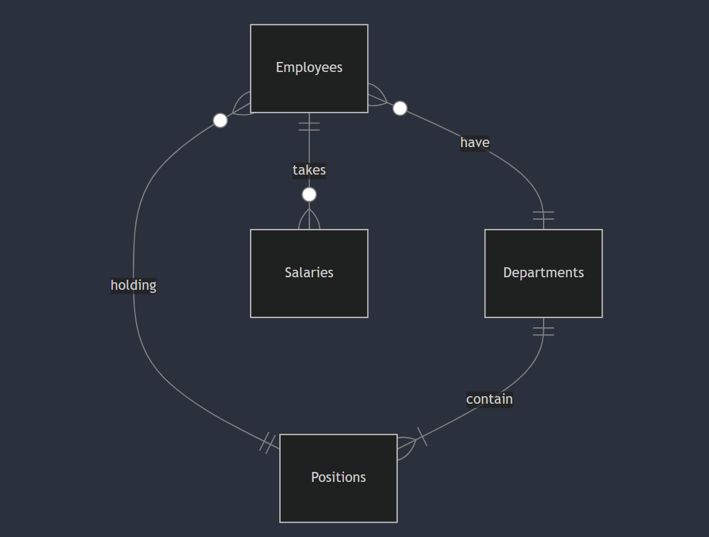

# CPF Payroll Management System

By Beh Kai Le Rinchen

Video overview: https://youtu.be/pECbPOKfJUs

## Description
In Singapore, Central Provident Fund (CPF) is Singapore’s social security system. CPF helps Singapore Citizens and Permanent Residents set aside funds for retirement, housing, and medical expenses etc.

More information of CPF [here](https://www.cpf.gov.sg/employer).
## Scope
* Purpose

Due to CPF, a business in Singapore would have to utilise a payroll management system that takes the employees' gross salaries, and computes the social security benefits according to age. A full breakdown of CPF computation is listed [here](https://www.cpf.gov.sg/employer/employer-obligations/how-much-cpf-contributions-to-pay#section-header-1452036554).

* Database schema

The tables are `employees`, `departments`, `positions` and `salaries`. There is 1 view table called `cpf_check`.

## Functional Requirements

* What a user can do:

The user can `INSERT INTO salaries` a certain salary amount, as well as the appropriate social security percentages to compute the take-home pay, employee contributions and the employer contributions in a view table called `cpf_check`. Additionally, the user can add a `WHERE pay_date BETWEEN '?' AND '?'` clause in `cpf_check` to filter the view by pay date.

* Limitations

This database cannot automatically calculate the age of the employees, so the user would have to use the `UPDATE employees SET age = ?` clause to update the employees' birthdays manually.

This database also cannot automatically determine the appropriate social security benefits based on age. Therefore the user has to refer to the latest values from the CPF website and key in the right percentages accordingly.

## Representation

### Entities
The entities in payroll.db include `employees`, `departments`, `positions` and `salaries`.
```
CREATE TABLE employees (
    id INTEGER PRIMARY KEY AUTOINCREMENT,
    name TEXT NOT NULL,
    age INTEGER NOT NULL,
    department_id INTEGER,
    position_id INTEGER,
    join_date TEXT NOT NULL,
    FOREIGN KEY (department_id) REFERENCES departments(id),
    FOREIGN KEY (position_id) REFERENCES positions(id)
);
```
The `employees` table is often used as a junction table as it contains information of the department as well as the position at which the employee is working in. Name, age and join_date are critical information that is `NOT NULL` as name is required for identification, age is required for CPF computation, while join_date allows the user to determine seniority.
```
CREATE TABLE departments (
    id INTEGER PRIMARY KEY AUTOINCREMENT,
    department TEXT NOT NULL
);

CREATE TABLE positions (
    id INTEGER PRIMARY KEY AUTOINCREMENT,
    position TEXT NOT NULL
);
```
Both the `departments` and `positions` tables are similar in that they have only 2 columns. Both of them have a id which can be referenced in the `employees` table. Separate tables for both positions and departments are used for abstraction so that the department name is not constantly repeated for multiple job positions.
```
CREATE TABLE salaries (
    id INTEGER PRIMARY KEY AUTOINCREMENT,
    employee_id INTEGER,
    gross_salary INTEGER,
    employee_pct REAL,
    employer_pct REAL,
    pay_date DATE DEFAULT (DATE('now')),
    FOREIGN KEY (employee_id) REFERENCES employees(id)
);
```
The `salaries` table records the monthly payroll of all employees. As CPF percentages can sometimes be in increments of 0.5%, the `REAL` type is used for both employee_pct and employer_pct columns. `DATE DEFAULT (DATE('now'))` will automatically add a date in YYYY-MM-DD format when a salary is logged.

### Relationships
Below displays the Entity Relation (ER) diagram to provide an overview of the database schema:


## Optimizations
A view named `cpf_check` and an index called `pay_roll_index` exists within the database.
```
CREATE INDEX pay_date_index ON salaries (pay_date);
```
An index for pay_date was created as most queries run by the user will likely be filtered according to date. For example, the user wishes calculate the sum of CPF paid by the employer in the month of April, or inquire about salary progression of certain employees annually. Hence, the benefits of indexing pay dates outweigh the potential impact on storage.
```
CREATE VIEW cpf_check AS
SELECT name,
age,
FORMAT('$%.2f', gross_salary) AS salary,
CONCAT(employee_pct, '%') AS employee_pct,
CONCAT(employer_pct, '%') AS employer_pct,
FORMAT('$%.2f',(gross_salary * ((100-employee_pct)/100))) AS take_home,
FORMAT('$%.2f',(gross_salary * (employee_pct/100))) AS employee_contr,
FORMAT('$%.2f', (gross_salary * (employer_pct/100))) AS employer_contr,
pay_date
FROM salaries
JOIN employees ON salaries.employee_id = employees.id;
```
A view `cpf_check` allows for computation of columns such as take_home, employer_contr and employee_contr without having to create an overly large `salaries` table. It can also prettify the resulting view by formatting money and adding $ and % symbols without affecting the main data. The view automatically updates whenever a new log is inserted into `salaries`.
## Limitations

1. As this program uses SQLite, only one user would be able to access this database at any time.

2. The tables within payroll.db are meant to be future-proof. But in the event that the user wishes to alter the type of a column, it will be impossible to do so without deleting the entire table as SQLite does not support modifying types.

Copyright © 2024 Beh Kai Le Rinchen  
All rights reserved. No part of this software may be copied, redistributed or modified without written permission from the copyright owner.
